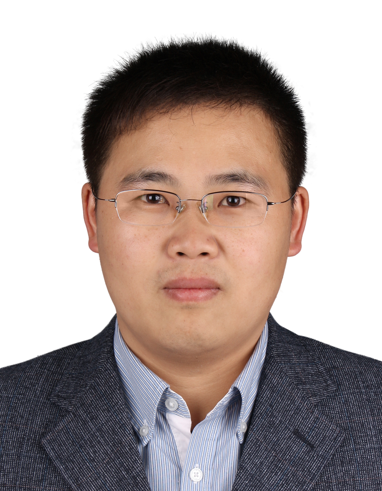

## Group Leader
### Dr. Yun-Feng Xiao

* Associate Professor with tenure
* B.S.(2002), Ph.D(2007), University of Science and Technology of China
* Room: West 446, Physics Building, Peking University
* Phone: 86(10)6276.5512
* E-mail: yfxiao[AT]pku[DOT]edu[DOT]cn

{.avator}

## Postdoctoral and Graduate Students
### Yanyan Zhi

* Postdoctoral scholar
* Ph.D., University of Alberta (Canada), 2014
* E-mail: yzhi[AT]pku[DOT]edu[DOT]cn

{.avator}
### Xiao-Chong Yu,

* Ph.D. candidate 2012
* B. S., Peking University, 2012
* E-mail: yuxc[AT]pku[DOT]edu[DOT]cn

{.avator}

### Li Wang,

* Ph. D. candidate 2013
* B. S., Peking University, 2013
* E-mail: windwang[AT]pku[DOT]edu[DOT]cn

{.avator}

### Shu-Xin Zhang,

* Master degree candidate 2014
* B. S., in School of Physics, Nanjing University, 2014
* E-mail: zsx_op[AT]pku[DOT]edu[DOT]cn

{.avator}

### Jian-Ning Xu,

* Ph.D. candidate 2014
* B. S., Nanjing University, 2014
* E-mail: jnxu[AT]pku[DOT]edu[DOT]cn

{.avator}

### Shui-Jing Tang,

* Ph. D. candidate 2015
* B. S., Wuhan University of Technology, 2015
* E-mail:

{.avator}

### Qi-Tao Cao,

* Ph.D. candidate 2015
* B. S., USTC, 2015
* E-mail:

{.avator}

## Undergraduates

### Rui-Shan Liu,

* Undergraduate 2012
* School of Physics
* E-mail:	liuruishan[AT]pku[DOT]edu[DOT]cn

{.avator}

### Ao-Xue Han,

* Undergraduate 2012
* School of Physics
* E-mail:	han_ao_xue[AT]126[DOT]com

{.avator}

### Kang-Jing Huang,

* Undergraduate 2012
* School of Physics
* E-mail:	huangkangjing[AT]gmail[DOT]com

{.avator}

### Xi Chen,

* Undergraduate 2012
* School of Physics
* E-mail:	1200011353[AT]pku[DOT]edu[DOT]cn

{.avator}

### He-Ming Wang,

* Undergraduate 2012
* School of Physics
* E-mail: wangheming[AT]pku[DOT]edu[DOT]cn

{.avator}

### Ze-Yang Li,

* Undergraduate 2013
* School of Physics
* E-mail: laser.li[AT]pku[DOT]edu[DOT]cn

{.avator}

### Pai Peng,

* Undergraduate 2013
* School of Physics
* E-mail: 1300017609[AT]pku[DOT]edu[DOT]cn

{.avator}

### Si-Zhen Wang,

* Undergraduate 2013
* School of Physics

### Fei Gao,

* Undergraduate 2013
* School of Physics

### Yu-Xin Wang,

* Undergraduate 2013
* School of Physics

## Alumni

Yong-Chun Liu 

* 9/2010 - 7/2015, Ph.D. Student

* Principal Investigator 

* Qian Xuesen Laboratory of Space Technology

Bei-Bei Li

* 9/2009- 7/2014, Ph.D. Student

* Post-doc

* The University of Queensland

Xue-Feng Jiang

* 9/2009 - 7/2014, Ph.D. Student

* Post-doc

* University of Oregon

Yi-Wen Hu

* 9/2011 - 7/2014, Master Student

* Ph.D. Candidate 2014

* University of Maryland

Bo-Qiang Shen 

* 2/2013 - 7/2015, Undergraduate

* Ph.D. Candidate 2015

* California Institute of Technology

Dong-Yu Chen 

* 2/2013 - 7/2015, Undergraduate

* Ph.D. Candidate 2015

* University of Southern California

Zhou-Chen Luo 

* 2/2013 - 7/2015, Undergraduate

* Ph.D. Candidate 2015

* University of Maryland, College Park

Yu-Feng Shen 

* 2/2013 - 7/2015, Undergraduate

* Ph.D. Candidate 2015

* Carnegie Mellon University

Lin-Bo Shao

* 2/2012 - 7/2014, Undergraduate

* Ph.D. Candidate 2014

* Harvard University

Meng-Yuan Yan

* 2/2012 - 7/2014, Undergraduate

* Ph.D. Candidate 2014

* Stanford University

Wei-Liang Jin

* 2/2012 - 7/2014, Undergraduate

* Ph.D. Candidate 2014

* Princeton University

Yi-Xiang Liu

* 5/2012- 10/2013, Undergraduate

* Ph.D. Candidate 2014

* MIT

William Clements

* 9/2012- 7/2013, Visiting student

* Graduate Student

* M.S. student at École polytechnique, France

Hao-Kun Li

* 5/2011- 6/2013, Undergraduate

* Ph.D. Candidate 2013

* University of California, Berkeley

Xue-Xin Ren

* 5/2011- 6/2013, Undergraduate

* Ph.D. Candidate 2013

* University of California, Berkeley

Qi-Fan Yang

* 5/2011- 6/2013, Undergraduate

* Ph.D. Candidate 2013

* California Institute of Technology

Xu Yi

* 12/2009- 6/2012, Undergraduate

* Ph.D. Candidate 2012

* California Institute of Technology

Qiu-Shu Chen

* 5/2010- 6/2012, Undergraduate

* Ph.D. Candidate 2012

* University of Michigan
